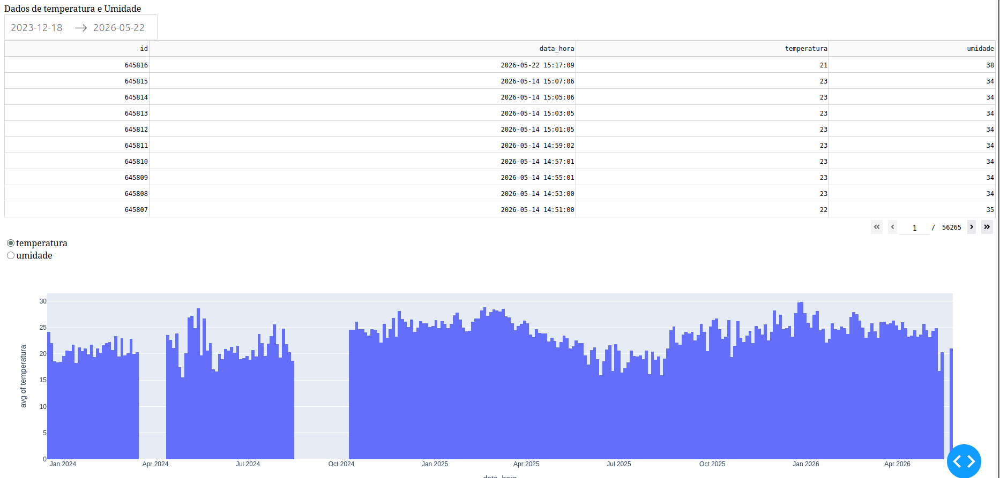

# MonitoAR

Sistema de monitoramento de temperatura e umidade para um abrigo de armazenamento de resíduos químicos da Faculdade de Tecnologia da UNICAMP.

O projeto utiliza um Raspberry Pi 3 conectado a um sensor DHT11 para coletar dados ambientais em intervalos regulares. As medições são armazenadas em um banco SQLite e visualizadas por meio de um dashboard web desenvolvido com Dash.

## Objetivo

O objetivo do MonitoAR é acompanhar as condições ambientais de um depósito de resíduos químicos, permitindo a visualização histórica da temperatura e da umidade do local.

Esse tipo de monitoramento auxilia na observação das condições do ambiente, no registro contínuo dos dados e na criação de uma base histórica para futuras análises.

## Tecnologias utilizadas

- Raspberry Pi 3
- Sensor DHT11
- Python 3
- SQLite
- Dash
- Plotly
- Pandas

## Arquitetura do projeto

```text
+-------------+        +---------------+        +-------------+        +--------------+
| Sensor DHT11| -----> | Raspberry Pi  | -----> | SQLite DB   | -----> | Dashboard    |
| Temp/Umid.  |        | Python Script |        | dados_temp  |        | Dash/Plotly  |
+-------------+        +---------------+        +-------------+        +--------------+

<h2>Dashboard</h2>

<p>Abaixo está um exemplo da visualização dos dados coletados pelo MonitoAR:</p>


